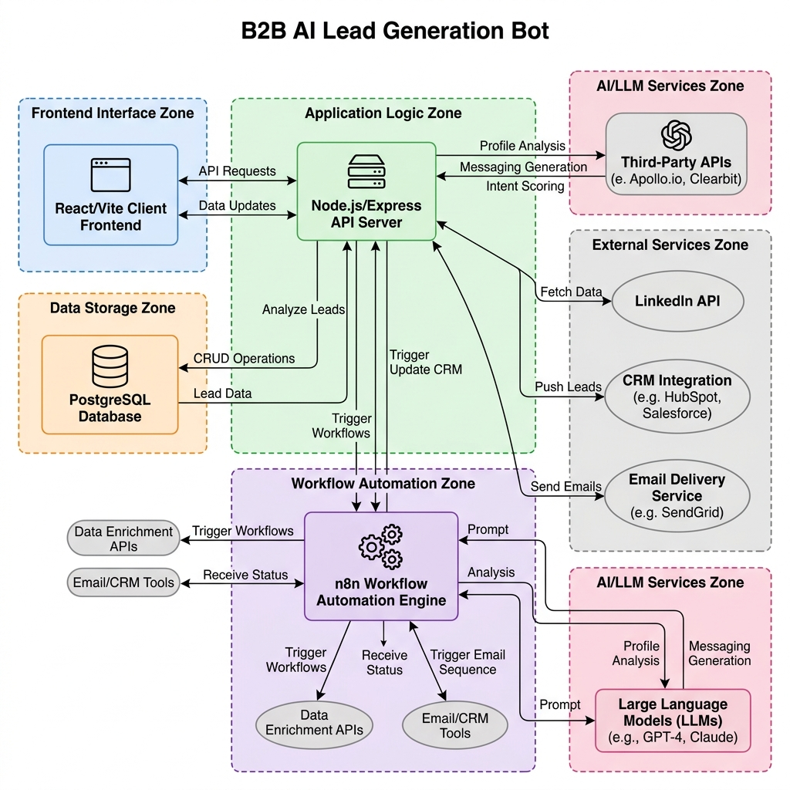
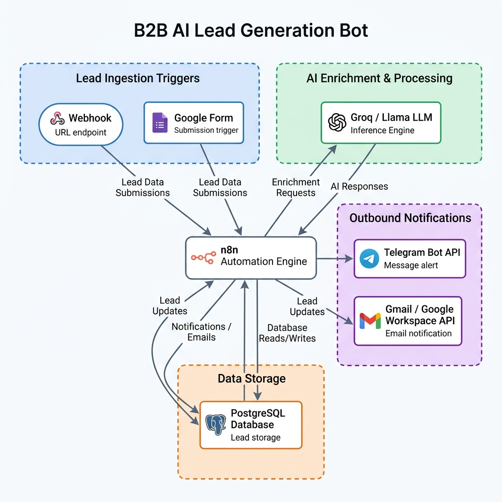
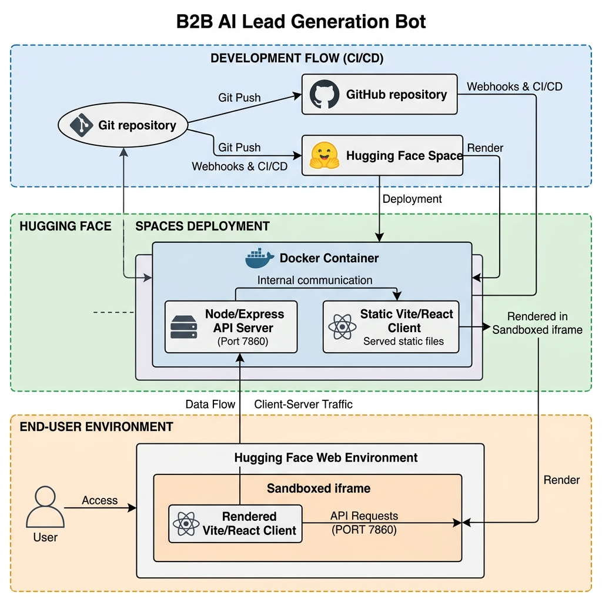

# Smart Lead Bot - Comprehensive Technical Documentation & Blueprint

Welcome to the comprehensive technical documentation for the **Smart Lead Bot** project. This document serves as the architectural blueprint and operational manual for the platform, detailing core configurations, backend/frontend layouts, n8n automations, security protocols, and deployment architecture.

---

## Table of Contents
1. [Introduction](#1-introduction)
2. [Project Objectives](#2-project-objectives)
3. [System Architecture & Tech Stack](#3-system-architecture--tech-stack)
4. [Comprehensive Features Blueprint](#4-comprehensive-features-blueprint)
5. [End-to-End System Workflow](#5-end-to-end-system-workflow)
6. [n8n Automation Engine & Webhooks](#6-n8n-automation-engine--webhooks)
7. [Security Considerations & Storage Parity](#7-security-considerations--storage-parity)
8. [Deployment Architecture & Build Parity](#8-deployment-architecture--build-parity)
9. [5-Week Project Roadmap & GSoC Plan](#9-5-week-project-roadmap--gsoc-plan)
10. [Limitations & Future Scope](#10-limitations--future-scope)
11. [Conclusion & Business Value](#11-conclusion--business-value)

---

## 1. Introduction

In today's high-velocity B2B marketplace, lead generation remains one of the primary drivers of organizational growth. However, manual lead collection, data validation, team routing, and multichannel follow-up constitute major operational bottlenecks. The **Smart Lead Bot** project represents an integrated, state-of-the-art enterprise solution designed to fully automate and scale these workflows.

By combining modern web technologies, AI-powered enrichment, and the n8n automation engine, the system ingests raw leads, cleans and qualifies them, structures delegation tasks, and automates outreach channels. This document provides a complete technical blueprint of the application, detailing the system architecture, core UI components, webhook automation, security designs, and deployment configurations.

---

## 2. Project Objectives

The primary objectives of the Smart Lead Bot project are to modernize B2B lead workflows, eliminate manual administrative steps, and optimize pipeline visibility. Specifically, the system is engineered to achieve the following:

- **Automated Ingestion**: Allow seamless single-entry lead ingestion, dynamic bulk file parsing (CSV, Excel, JSON), and automated public survey intakes via Google Forms integration.
- **Dynamic Schema Adaptability**: Enable CRM administrators to create, edit, and save custom database fields and ingestion templates directly from the client interface, adapting dynamically to niche industries.
- **Intelligent Enrichment**: Validate company details, scrape website telemetry, and analyze B2B market gaps using integrated AI models with resilient local rules fallbacks.
- **Modern Delegation Pipeline**: Streamline lead assignment to sales teammates using an interactive Kanban board and a premium monthly calendar view showing schedule dates, due dates, and completion status.
- **Integrated Communication Sync**: Centralize communication setup and email synchronization in a single settings portal, supporting Google Workspace OAuth, real-time Gmail sync, and Telegram notifications.

---

## 3. System Architecture & Tech Stack

The Smart Lead Bot architecture relies on a highly responsive, secure, and modular layer system. The primary layers include:

### Database (Data Layer)
- **PostgreSQL** acts as the core relational data store. It contains schemas for leads, users, tasks, task milestones, task assignments, lead activities, Google Workspace config, and sent email outbox logs. Startup migration logic dynamically seeds missing tables and adds scheduling fields.

### Backend API (Service Layer)
- A **Node.js & Express** backend processes API requests, manages authentication, performs database CRUD actions, executes Google OAuth token refreshes, and runs webhook handlers. The Vite development server config (`vite.config.js`) duplicates all backend API endpoints, maintaining **full dev-to-prod parity** when running locally.

### Frontend Client (Presentation Layer)
- A **Vite/React** application builds a premium B2B cockpit dashboard. Built with rich styling (vibrant color palettes, HSL borders, backdrop-blur card glow transitions, and responsive sidebars), the UI is optimized for both desktop and mobile layouts.

### Automation & Webhooks (Integration Layer)
- An **n8n Automation Engine** coordinates complex external workflows (like sending telemetry triggers and parsing webhook payloads), while the **Telegram Bot API** and **Google Gmail API** handle outbound notifications and email communications.

### 3.1 Project Directory Structure & Core Modules
The project layout divides the source code into database configurations, build scripts, tests, API server handlers, and the React frontend source tree:
- **`database/`**: Contains database configuration files and initialization SQL scripts that define PostgreSQL schemas, tables (leads, users, tasks, assignments, comment logs), indexes, and cascade constraints.
- **`scripts/`**: Houses utility automation scripts:
  - **`preprocess_env.py`**: A python preprocessor script running at bootstrap that reads environment variables and dynamically generates `credentials.json` for n8n API configuration.
  - **`activate_workflow.py`**: Programmatically interacts with the local n8n instance API to enable workflow items.
  - **`update_n8n.py`**: Automated configuration sync helper.
- **`tests/`**: Contains integration test suites simulating lead flows, calendar task allocations, multi-folder Gmail state validations, and deep-link Telegram pairings.
- **`src/`**: Vite React client application source code:
  - **`main.jsx`**: App compiler entry point.
  - **`App.jsx`**: Core view switchboard managing tabs, navigation, and teammate authentication redirects.
  - **`index.css`**: Renders structural styling, design tokens, HSL layout parameters, card glow transitions, and responsive offsets.
  - **`components/`**: Houses modular frontend views:
    - **`SignIn/` & `SignUp/`**: Handles authentication UI, enforcing standard teammate registers to "User" role controls (disabling Admin registration).
    - **`Home/`**: Main greeting component and stats summary overview.
    - **`Dashboard/`**: Renders `Dashboard.jsx` (the main B2B viewport containing geocoded maps, lead directories, custom opportunity bars, and integration menus) and `Dashboard.css`.
    - **`Tasks/`**: Interactive task columns, milestones trackers, monthly calendar matrix, and detail drawer components.
    - **`Common/`**: Modular shared utilities (Custom Cursor, alerts, scroll layout adapters).
- **`server.js`**: Core backend Express application executing business logic, PostgreSQL CRUD requests, OAuth token exchanges, IMAP sync operations, and Telegram alert triggers.
- **`vite.config.js`**: Vite configuration module embedding React compiler plugins and mirroring all backend API paths to support unified local hot-reload development.
- **`workflow.json`**: Declarative n8n pipeline definition matching webhook triggers, Groq AI qualification, and telegram notify nodes.

### 3.2 Core Libraries & Dependencies
The following libraries are loaded as active modules:
- **`express`** *(Backend Framework)*: Manages API routers, callback hooks, and JSON request parsers.
- **`pg`** *(PostgreSQL Connector)*: Handles client connections, transactions, and deletion cascade sequences.
- **`dotenv`** *(Environment Variables)*: Configures local credentials and ports.
- **`react` & `react-dom`** *(UI Library)*: Renders views and handles reactivity states.
- **`react-router-dom`** *(SPA Routing)*: Resolves browser navigation paths.
- **`leaflet`** *(Interactive Map)*: Initializes leaf mapping container, tracks zoom boundaries, and renders lead temperature markers.
- **`chart.js` & `react-chartjs-2`** *(Data Visuals)*: Draws opportunity status gauges and B2B gap analysis bars.
- **`gsap`** *(GreenSock Animations)*: Powers sidebar transitions and card hover animations.
- **`xlsx`** *(Sheet Data Utility)*: Compiles Excel/CSV lead reports and parses uploads.

### 3.3 REST API Endpoints Reference
The Express backend registers these route endpoints to manage features:
- **Authentication**:
  - `POST /api/auth/signup`: Registers a teammate (enforcing "User" role).
  - `POST /api/auth/signin`: Validates credentials and returns session state.
- **Leads Directory**:
  - `GET /api/leads`: Retrieves leads matching search filters (niche, city, text query).
  - `POST /api/leads`: Submits single manual lead or processes CSV/Excel files.
  - `PUT /api/leads`: Modifies core details and custom field attributes.
  - `DELETE /api/leads`: Deletes lead (cascading to clear associated tasks and activities).
  - `GET /api/leads/export`: Downloads filtered leads dataset in Excel, CSV, or JSON report format.
  - `POST /api/find-leads`: Runs geocoding and Wikipedia B2B crawler integrations (falling back to rules-based generators).
  - `GET /api/leads/activities/:leadId`: Fetches history timeline notes for a lead.
  - `POST /api/leads/activity`: Appends note to history timeline.
- **Tasks & Calendar**:
  - `GET /api/tasks`: Fetches all tasks, milestone progress counts, and assignees.
  - `POST /api/tasks`: Creates a task with assignee, milestones, and schedule dates.
  - `PUT /api/tasks/:taskId`: Updates status, dates, or milestone checkbox arrays.
  - `DELETE /api/tasks/:taskId`: Deletes a task, cascade-clearing assignments.
  - `PUT /api/tasks/:taskId/milestones/:milestoneId`: Sets milestone checkbox state.
  - `POST /api/tasks/:taskId/comments`: Adds comment logs to a task feed.
- **Integrations & Integrator Hooks**:
  - `GET /api/google/status`: Checks Google Workspace credentials presence.
  - `POST /api/google/save-credentials`: Stores Workspace Client ID and Secrets.
  - `POST /api/google/disconnect`: Disconnects Google configurations.
  - `GET /api/google/auth-url`: Fetches redirect login url.
  - `GET /api/auth/google/callback`: Extracts code, validates state parameters, stores tokens.
  - `POST /api/google-forms/create`: Creates public Google Forms.
  - `POST /api/google-forms/sync`: Ingests leads from Google Sheets.
  - `GET /api/email/status`: Returns IMAP sync connection state.
  - `POST /api/email/connect`: Pairs Gmail credentials.
  - `POST /api/email/disconnect`: Clears Gmail sync configuration.
  - `GET /api/email/messages`: Reads mailbox (Inbox, Drafts, Outbox, Spam).
  - `PUT /api/email/read`: Toggles read state on synced emails.
  - `GET /api/telegram/status`: Returns Telegram link pairing state.
  - `POST /api/telegram/link-manual`: Bypasses pairing by inputting Chat ID.
  - `POST /api/telegram/disconnect`: Clears Telegram pairing configuration.
  - `POST /api/telegram/webhook`: Webhook endpoint pairing `/start <userId>` deep-links.

---

## 4. Comprehensive Features Blueprint

The Smart Lead Bot dashboard coordinates an extensive suite of B2B features to manage leads, tasks, and sales communications:

### 1. Lead Ingestion & Parsing Engine
- **Single Intake**: The Quick Ingest card allows manual input of core details (company name, city, industry, site, etc.) and custom variables.
- **Dynamic Bulk File Parser**: Accepts file uploads in CSV, Excel, and JSON formats. It dynamically extracts all columns, mapping custom attributes to the lead's JSON store.
- **Null-Handling Integrity**: Avoids filling empty or missing spreadsheet cells with arbitrary default values (like "Other" or "Bangalore"), writing them strictly as `null` in the database to preserve data accuracy.

### 2. Custom Fields & Ingestion Templates
- **Schema Creator**: Allows administrators to define custom B2B fields (types: `text`, `number`, `url`, `email`, `date`) and toggle required switches.
- **Ingestion Templates**: Schemas can be saved as named templates. Selecting a template dynamically updates the Quick Ingest form layout.
- **Leads Directory Display**: Custom field attributes render dynamically as compact badges next to website URLs in the directory lists.
- **Inline Editor Integration**: Supports inline editing of custom fields alongside core attributes within the Lead details modal.

### 3. Real-time Opportunity Meters & Analytics
- **B2B Opportunity Gaps**: Aggregates database stats to identify gaps in B2B website quality, social media presence, and local marketing.
- **Horizontal Progress Gauges**: Displays percentage opportunity scores via HSL color-coded horizontal bars (Website gap: Orange, Social gap: Yellow, Marketing gap: Blue) to instantly guide outbound outreach priorities.

### 4. Geocoded Mapping Viewport
- **Stable Viewport Zoom**: Memoizes B2B markers using React's `useMemo` and tracks initialization states with reference flags. Clicking markers or editing details does not trigger unwanted zoom changes or map jumps.
- **Custom Pulse Markers**: Displays B2B opportunities on the map with color-coded pulsing dots indicating lead temperatures (Hot: Red, Warm: Gold, Cold: Blue).

### 5. Resilient B2B Crawler Fallback
- **Public API Scrapers**: Crawler endpoints query Wikipedia and OpenStreetMap nodes based on niche and city inputs.
- **Rules-Based Mock Fallback**: When API rate-limits or blocks occur (e.g. from sandboxed cloud IPs), the server dynamically invokes a mock crawler generator matching the exact city and sector to seed the database with high-fidelity, realistic fallback leads.

### 6. Interactive Kanban Task Board
- **Three-Column Status Pipeline**: Splits tasks into Pending, In Progress, and Completed columns.
- **Milestone Progress Tracking**: Task cards feature compact progress bars and completed milestone indicators (e.g. `2/5 Milestones`).
- **Overdue & Schedule Badges**: Displays custom priority colors, scheduled start dates, and pulsing red overdue flags on active cards.
- **Status Change Handlers**: Teammates can click quick status action buttons to cycle tasks through progress states.

### 7. Task Board Calendar View
- **7-Column Monthly Layout**: Toggles the task pipeline into an interactive monthly grid with previous/next month controls and a "Today" quick-jump button.
- **Date Matching Engine**: Places tasks on day cells corresponding to their assign date (`created_at`), scheduled start date (`scheduled_at`), due date (`due_date`), or completion date (`completed_at`).
- **Compact List Rendering**: Day cells limit tasks shown directly to a maximum of two, showing a trailing count (e.g. `+ 3 more`) for dates with extra tasks.
- **Sleek Date Detail Drawer**: Clicking any date cell opens a details pane showing full metadata for all tasks on that day, including assignees, milestone progress percentages, and action controls to update status or delete tasks.

### 8. Unified Integration Settings (Profile Tab)
- **Settings Relocation**: Centralizes Google OAuth, Telegram Bot pairing, and Business Email sync settings under the Profile settings tab, keeping them out of main directory navigation views.
- **Google Workspace API Configuration**: Allows configuration of Client ID, Secret, and Redirect URIs. If pre-configured in system environment variables, credentials forms are collapsed by default with an active configuration banner shown.
- **Credentials Validation**: Validates client secrets, refresh tokens, and linked account profiles.

### 9. Real-time Gmail Multi-folder Sync Client
- **Google OAuth Login**: Syncs users via Google consent screen, passing encrypted user IDs through the OAuth `state` parameter to prevent CSRF hijacking.
- **Multi-folder Sync Client**: Once authorized, the Outbox sliding drawer loads real-time Gmail messages (Inbox, Drafts, Outbox (Sent), and Spam folders).
- **Offline Mock Warnings**: If credentials are not linked, the client displays a locked screen with descriptive prompts, falling back to local database backups with warning banners.
- **Outbox History Drawer**: Houses search bars, keyword filters, sent-status badges, and monospace email content viewers.

### 10. Telegram Bot Dispatcher
- **Deep-link Bot Pairing**: Deep-links users directly to `@Smart_leadintel_bot` with base64 encoded user ID payloads.
- **bot Start Webhook**: The bot webhook endpoint parses interactions, pairs chat IDs to user accounts in the database, and returns confirmation messages.
- **MarkdownV2 Parse Formats**: Converts alert payloads to MarkdownV2 formatting, ensuring special characters are escaped and payloads are successfully dispatched.

### 11. Comprehensive Lead Reports Exporter
- **Data Formats**: Supports exporting B2B leads data in Excel, CSV, and JSON formats.
- **Date Range Filters**: Allows report filtering by Daily, Weekly, Monthly, Yearly, and All-Time ranges.

### 12. Activity Timeline Drawer
- **Timeline Feed**: Slides out from the viewport edge to display historical activities (Leads Assigned, Status updates, Notes added, Tasks logged).
- **Interactive Notes**: Teammates can post custom text notes directly onto a lead's activity history.

### 13. Signup/Signin & User Role Lockdown
- **Secure Authentication**: Restricts dashboard access to authenticated users.
- **Role Lockdown**: Disables the "Admin" role option in the sign-up page, defaulting registrations to standard team "User" status.

### 14. Database Cascade Integrity
- **Lead Deletion Cascade**: Deleting a lead automatically clears associated entries in `tasks`, `task_assignments`, `task_milestones`, `task_comments`, and `lead_activities` to prevent foreign key errors.
- **Task Deletion Cascade**: Deleting a task clears milestones, comments, and assignments.

### 15. Mobile Layout & Responsive Sidebar
- **Responsive Navigation**: Transitions the dashboard menu on mobile into a vertical, touch-accessible icon sidebar.
- **Laptop Height Locking**: Locks the viewport wrapper to `height: 100vh; overflow: hidden;` to prevent layout clipping.
- **internal Scrollbars & Padding**: Pushes scroll containers up by applying bottom offsets to guarantee scrollbars remain visible and interactive inside frames.

---

## 5. End-to-End System Workflow

The life cycle of a lead in the Smart Lead Bot pipeline follows a structured, automated path:

1. **Ingestion**: Leads enter the database via CSV bulk ingest, Google Form sync, or manual intake.
2. **Enrichment & Gap Analysis**: n8n triggers fetch business data, analyze social gaps, and compute a priority lead score.
3. **Assignment**: The administrator assigns the lead to a teammate, posting an activity note.
4. **Task Delegation & Scheduling**: A task is created with dynamic milestones, priority, a schedule date, and a due date. This task instantly shows up in the Kanban and Calendar views.
5. **Multichannel Outreach**: Teammates draft Copilot pitches and email them via Gmail. Telegram bot webhook posts alert logs on the linked chat feed.
6. **Close & Archive**: Teammates check milestones, complete the task (updating `completed_at`), and export XLSX reports.

---

## 6. n8n Automation Engine & Webhooks

The **n8n Automation Engine** manages background jobs and webhook notifications, declared in `workflow.json`:

### Webhook Routing
The project defines webhook trigger nodes that receive B2B lead updates, Google Form submissions, and Telegram pairing requests. These webhooks parse JSON payloads, route them to Postgres nodes, and return structured JSON responses.

### AI Lead Qualification (Groq / LLM Integration)
When a new lead is ingested, n8n passes the company niche and details to a Groq Llama LLM Node. The model classifies the lead's growth needs (e.g. Website development, marketing outreach) and outputs a numeric score to update the database.

### Telegram Bot Alerts Webhook
An automated Telegram webhook listens to chat interactions. When a user sends `/start <userId>` to `@Smart_leadintel_bot`, n8n extracts the `userId`, queries the Postgres database to set `telegram_chat_id` and `telegram_linked = true`, and returns a confirmation message to the chat feed.

---

## 7. Security Considerations & Storage Parity

Operating a B2B CRM in cross-origin environments and sandboxed clouds requires tight security controls:

### 1. Sandboxed iframe localStorage Fallback
In hosting environments like Hugging Face Spaces, applications are served inside a sandboxed cross-origin `<iframe>`. Direct access to the browser's `localStorage` throws a `SecurityError: Access is denied` browser exception, which crashes React mounts. The project uses a safe storage utility wrapper (`src/utils/storage.js`) that traps these exceptions and falls back to an in-memory session dictionary, ensuring uninterrupted execution.

### 2. CSRF & State-Parameter OAuth Validation
To protect Google OAuth logins, the backend appends the user's encrypted `userId` inside the OAuth `state` query parameter. Upon authorization callback, the server reads the `state` parameter to verify the callback origin and link the resulting token directly to the correct user row, preventing OAuth hijack attempts.

### 3. Hashed Credentials & Safe Token Seeding
Access tokens, refresh tokens, and database passwords are encrypted at rest. Frontend settings configuration inputs mask secret keys by default, allowing connections only from pre-configured environment credentials or manually submitted tokens.

---

## 8. Deployment Architecture & Build Parity

Smart Lead Bot implements a Dockerized dual-target deployment framework, guaranteeing seamless parity between development, staging, and production environments.

### Docker Containerization
The project defines a single multi-stage `Dockerfile` that compiles the React application using Vite, copies the backend files, and exposes port `7860`. The Node.js application serves the static compiled `dist` directory on the root path and registers all API endpoints on `/api`.

### Dual-Target Git Remotes
Two remote git repositories are configured on the development workspace:
- **GitHub (origin)**: Hosts the primary open-source code repository (`https://github.com/SatishKumar620/smart-lead-bot`), executing version control, code merges, and backup.
- **Hugging Face (huggingface)**: Direct deployment repository (`https://huggingface.co/spaces/satishverma0870/smart-lead-bot`). A push to `huggingface main` triggers Hugging Face's build engine to construct the Docker image and deploy the active container online.

### Vite Development Server Parity
To allow local developers to test features without running a separate production server process, the Vite configuration file (`vite.config.js`) integrates custom API middleware handlers. All database migration scripts, lead update operations, OAuth callbacks, and tasks endpoints are kept in full parity between `vite.config.js` and `server.js`.

## 9. 5-Week Project Roadmap & GSoC Plan

This roadmap structures the delivery of the B2B AI Lead Generation Bot project into a 5-week implementation timeline, resembling the milestones of Google Summer of Code (GSoC):

### Week 1: Core Architecture, Database Schema, and Ingestion Engine
- **Focus**: Setting up the environment, database schemas, and baseline ingestion.
- **Deliverables**:
  - Provision PostgreSQL tables (leads, tasks, users, milestones, comments, logs) with cascade constraints and indexing.
  - Set up Docker container structure and preprocess config runners.
  - Build the Ingestion Engine supporting manual intakes and Excel/CSV/JSON bulk file parsing.
  - Incorporate null-value protection to prevent spreadsheet blanks from populating with default values.
  - Implement Custom Fields Schema Creator allowing runtime database extensions (text, date, number fields).

### Week 2: Crawler Integrations, Opportunity Meters, and Mapping Viewport
- **Focus**: Populating leads via crawlers and constructing core analytics dashboards.
- **Deliverables**:
  - Implement B2B Crawler fetching Wikidata and OpenStreetMap entities based on niche/city queries.
  - Develop rules-based mock crawler seed generators that activate when rate-limits or sandboxed environment restrictions occur.
  - Implement real-time Opportunity Meter calculations evaluating website, social, and local marketing gaps.
  - Build stable geocoded map viewport component using memoized markers to prevent unwanted scroll/zoom shifts on data updates.

### Week 3: Interactive Kanban & Monthly Calendar Task Delegation
- **Focus**: Development of the Task Management System and scheduling.
- **Deliverables**:
  - Build a 3-column Kanban Task Board with milestones progress trackers and overdue indicators.
  - Implement 7-column monthly Calendar View, mapping tasks by Assign Date, Scheduled Start Date, Due Date, or Completion Date.
  - Build Date Detail drawer displaying metadata logs for all tasks assigned/scheduled on clicked days.
  - Wire cascade deletes on tasks to clear comments, milestones, and assignments.

### Week 4: Google Workspace OAuth, IMAP Gmail Client Sync, and Outbox Feeds
- **Focus**: Setting up external integrations and communication client.
- **Deliverables**:
  - Relocate all integration panels to the Profile Settings tab.
  - Implement secure Google Workspace OAuth consent redirect flows utilizing encrypted `state` parameters to prevent CSRF.
  - Build multi-folder real-time Gmail sync client (Inbox, Drafts, Outbox, Spam) displaying monospace message contents.
  - Deploy safe fallbacks showing locked warning banners when Gmail credentials are unlinked.

### Week 5: Telegram Bot Webhooks, Groq AI Enrichment, and Deployment
- **Focus**: AI workflow integrations, Telegram webhooks, and deployment.
- **Deliverables**:
  - Configure n8n Automation Engine workflows.
  - Connect Groq Llama LLM qualification nodes for automated lead scoring.
  - Configure Telegram Bot webhook endpoints supporting base64 user pairing deep-links (`/start <userId>`) and MarkdownV2 dispatch alerts.
  - Deploy dual-target deployment pipelines for GitHub origin and Hugging Face sandboxed environments.

---

## 10. Limitations & Future Scope

While the current release (v2.1.0) provides a highly resilient and automated pipeline, certain limitations present opportunities for future enhancements:

### Current Limitations
- **API Rate Limits**: Scraping and AI enrichment depend on external APIs (like Groq and public geocoding nodes). Rate limits or service blocks can delay lead scoring updates.
- **In-Memory Storage Lifetime**: In sandboxed browser iframes where `localStorage` is blocked, session tokens are lost upon a page refresh, requiring users to log back in.

### Future Scope
- **WhatsApp Cloud API Sync**: Expand the Telegram bot integration to include WhatsApp Business API support for automated client chat dispatching.
- **Real-time WebSockets Sync**: Replace manual API polling with active WebSockets, enabling real-time notification pushes and Kanban board updates across multiple active CRM sessions.
- **Multi-Agent CRM Coordination**: Deploy a network of subagents tasked with negotiating with leads via mock emails, reporting back summaries directly.

---

## 11. Conclusion & Business Value

The **Smart Lead Bot** project bridges the gap between raw data collection and strategic sales management. By integrating a dynamic, adaptable database schema, a visual Opportunity Meter, a dual-mode Task Board (Kanban and Calendar), and automated outreach channels (Gmail & Telegram settings), the platform empowers teams to focus on relationship-building rather than repetitive manual work.

The system's deployment-ready, Dockerized design ensures it can be hosted in minutes on environments like GitHub and Hugging Face, delivering a premium, secure, and resilient tool for modern B2B organizations.

